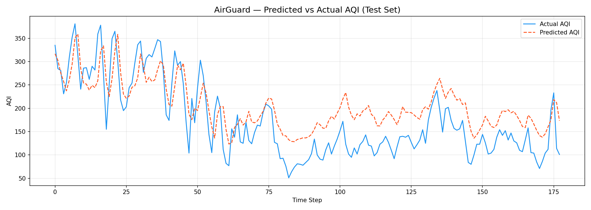

# AirGuard — Personalized AQI Health Risk Forecaster

> A deep learning-powered air quality forecasting app that predicts next-day AQI and delivers personalized health advisories based on your age, health condition, and city.


---

## 📸 Demo



---

## What It Does

AirGuard uses a **Bidirectional LSTM (BiLSTM)** neural network trained on India's city-level AQI data (2015–2020) to:

- **Forecast next-day AQI** for any of the 26 Indian cities in the dataset
- **Classify risk** as Low / Medium / High / Very High based on AQI category
- **Personalize health advice** based on age group and health condition (healthy, asthmatic, diabetic, elderly)
- **Visualize trends** with a 7-day AQI history chart, pollutant breakdown, and an AQI speedometer gauge

---

## Project Structure

```
AirGuard/
│
├── data/
│   └── city_day.csv                  ← Kaggle India AQI dataset
│
├── src/
│   ├── data/
│   │   ├── loader.py                 ← CSV ingestion, city filtering
│   │   ├── cleaner.py                ← Null handling, outlier clipping
│   │   ├── feature_engineer.py       ← Rolling stats, lag features, cyclical encoding
│   │   └── windowing.py              ← Sliding window builder → (X, y) arrays
│   │
│   ├── model/
│   │   ├── architecture.py           ← BiLSTM model definition
│   │   ├── trainer.py                ← Training loop, callbacks, checkpointing
│   │   └── evaluator.py              ← MAE, RMSE, predicted vs actual plot
│   │
│   ├── pipeline/
│   │   ├── preprocessor.py           ← Orchestrates full preprocessing pipeline
│   │   └── inference.py              ← Load saved model + scaler → predict
│   │
│   └── risk/
│       ├── aqi_classifier.py         ← Maps predicted AQI → risk category
│       └── health_advisor.py         ← Personalized health advice generator
│
├── outputs/
│   ├── models/                       ← Saved .keras model (git-ignored)
│   ├── scalers/                      ← Saved scaler .pkl files (git-ignored)
│   └── plots/                        ← Predicted vs actual charts
│
├── config.py                         ← All hyperparameters and paths
├── train.py                          ← Entry point: full training pipeline
├── app.py                            ← Streamlit frontend
└── requirements.txt
```

---

## Model Architecture

| Component | Detail |
|---|---|
| Model type | Bidirectional LSTM |
| Layer 1 | BiLSTM (128 units) + Dropout (0.3) |
| Layer 2 | BiLSTM (64 units) + Dropout (0.3) |
| Layer 3 | Dense (32 units, ReLU) |
| Output | Dense (1 unit, linear) — AQI value |
| Loss | Mean Squared Error |
| Optimizer | Adam (lr=0.001) |
| Input window | 30 days |
| Parameters | ~325K |

**Feature engineering includes:**
- Rolling mean/std over 3, 7, 14-day windows
- Lag features for AQI (1, 2, 3, 7 days)
- Cyclical encoding of day-of-year (sin/cos)
- MinMax normalization (separate scalers for features and target)

**Training callbacks:**
- `EarlyStopping` — patience=8, restores best weights
- `ModelCheckpoint` — saves best val_loss model
- `ReduceLROnPlateau` — halves LR after 4 stagnant epochs

---

## Getting Started

### 1. Clone the repo
```bash
git clone https://github.com/yourusername/AirGuard.git
cd AirGuard
```

### 2. Install dependencies
```bash
pip install -r requirements.txt
```

### 3. Download the dataset
Get `city_day.csv` from [Kaggle — Air Quality Data in India](https://www.kaggle.com/datasets/rohanrao/air-quality-data-in-india) and place it in the `data/` folder:
```
AirGuard/data/city_day.csv
```

### 4. Train the model
```bash
python train.py --city Delhi
```
Training takes ~2–5 minutes on CPU. The model and scalers are saved to `outputs/`.

### 5. Launch the app
```bash
streamlit run app.py
```
Open your browser at `http://localhost:8501`.

---

## Results

Evaluated on a held-out 15% temporal test split for Delhi:

| Metric | Value |
| Test MAE | ~42 AQI units |
| Test RMSE | ~48 AQI units |
| Best val_loss | 0.0070 |
| Epochs trained | 40 (early stopped) |

> Note: MAE/RMSE are reported in original AQI scale after inverse scaling. Performance varies by city and data density.

---

## App Features

| Feature | Description |
| AQI Gauge | SVG speedometer showing predicted AQI with colored risk bands |
| 7-Day Trend | Line chart of recent AQI history + dashed forecast line |
| Pollutant Breakdown | Bar chart of PM2.5, PM10, NO2, SO2, CO, O3 levels |
| Health Advisory | Personalized advice based on age + health condition |
| Demographic Cards | Risk status for children, elderly, asthmatic, active groups |
| City Selector | 26 Indian cities supported |
| Confidence Range | ±15 AQI prediction interval shown on gauge |

---

## Tech Stack

| Layer | Technology |
| Deep Learning | TensorFlow 2.19 + Keras 3.x |
| ML Utilities | scikit-learn 1.4 (MinMaxScaler) |
| Data Processing | pandas 2.2, numpy 1.26 |
| Visualization | matplotlib 3.8, seaborn 0.13 |
| Frontend | Streamlit 1.35 |
| Model Persistence | joblib 1.4 (scalers), Keras .keras format |

---

## Dataset

**Source:** [Air Quality Data in India — Kaggle](https://www.kaggle.com/datasets/rohanrao/air-quality-data-in-india)

- **Coverage:** 26 Indian cities, 2015–2020
- **Frequency:** Daily measurements
- **Key columns:** `City`, `Date`, `PM2.5`, `PM10`, `NO2`, `SO2`, `CO`, `O3`, `AQI`, `AQI_Bucket`

---

## Acknowledgements

- Dataset by [Rohan Rao](https://www.kaggle.com/rohanrao) on Kaggle
- AQI category thresholds based on India's CPCB (Central Pollution Control Board) standards

---

*Built with as a portfolio project — AirGuard demonstrates end-to-end ML engineering from raw data ingestion to a production-style Streamlit deployment.*
